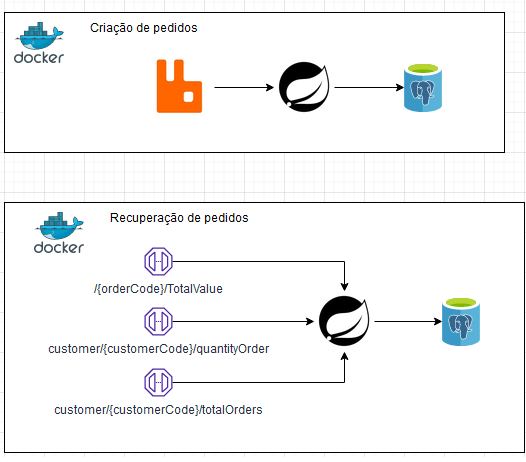
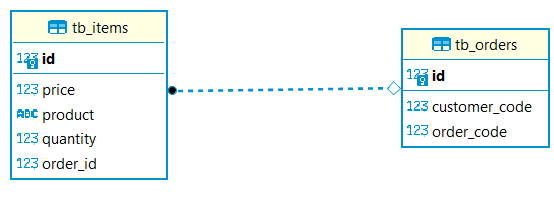

# BTG Pactual - Desafio

### Arquitetura:


### ER Diagrama:


### Docker Hub

- https://hub.docker.com/repository/docker/gusttadev/desafio-btg-back/general

### Github

- https://github.com/GusttaDev/desafio-btg

### Stack utilizadas:

- JAVA 17 (https://www.oracle.com/java/technologies/javase/jdk17-archive-downloads.html)
- DOCKER (https://www.docker.com/products/docker-desktop/)
- RABBITMQ (https://www.rabbitmq.com/)
- POSTGRES (https://www.postgresql.org/)

#### Subindo os containers com Postgres, RabbitMQ e o back-end da aplicação
- docker-compose up -d

#### Parar container
- docker-compose stop

#### Contrato proposto

```json
{
  "codigoPedido":1001,
  "codigoCliente":1,
  "itens":[
    {
      "produto":"lápis",
      "quantidade":100,
      "preco":1.10
    },
    {
      "produto":"caderno",
      "quantidade":10,
      "preco":1.00
    }
  ]
}

```

#### API REST que permita consultar as seguintes informações:
- Valor total do pedido
- Quantidade de Pedidos por Cliente
- Lista de pedidos realizados por cliente

### URL Base dos endpoints:

- http://localhost:8081/api/orders/

### Swagger

- http://localhost:8081/swagger-ui/#/

### Futuras melhorias

- Repensar a aplicação para gerar novos microserviços ou até mesmo nova arquitetura estrutural
- Utilização de BDD/TDD
- Utilizar a DLQ rabbit criada para futuros erros gerados
- Realizar teste de regreção, A/B e stress
- Construção de pipeline automatizada
